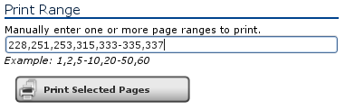
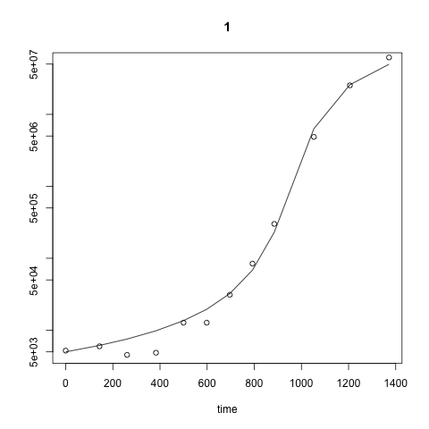

## The R code from QMRA, 2nd Ed.

This document describes a process to extract, clean-up, and run the R code from:

[Quantitative Microbial Risk Assessment, 2nd Edition](http://www.wiley.com/WileyCDA/WileyTitle/productCd-1118145291,subjectCd-CH20.html) 
by Charles N. Haas, Joan B. Rose, and Charles P. Gerba. (Wiley, 2014).

This is the copyright statement for the book:

> © Haas, Charles N.; Rose, Joan B.; Gerba, Charles P., Jun 02, 2014, 
> Quantitative Microbial Risk Assessment Wiley, Somerset, ISBN: 9781118910528

We have been licensed by Wiley to post the R-code "figures" from the book
on [https://github.com/brianhigh/envh543](https://github.com/brianhigh/envh543).

Here is our [RightsLink](http://www.copyright.com/) license number:

```
License Date: Mar 18, 2016
License Number: 3831970414111
Type Of Use: Website
```

The R-code has been modified so that it will run and will be more readable. The 
original code snippets published in the book were generally too buggy to use 
without these modifications. The most common error was to use `< -` for
assignment instead of `<-`. These issues resulted in unrecoverable errors. These
and other errors have been fixed in the code below.

## Extract the code from the PDF

The text book is 
[available as an eBook](http://alliance-primo.hosted.exlibrisgroup.com/UW:all:CP51230982940001451) 
from UW Libraries.

The PDF was created by printing select pages from EBL Reader and saving the 
result as PDF.



These `bash` commands will extract the R code from the PDF and list the figures. 

```{r pdf-conversion, engine='bash', eval=FALSE}
pdftotext \
    "Quantitative Microbial Risk Assessment.pdf" \
    "Quantitative Microbial Risk Assessment.txt"

egrep -i 'R function|R code|R listing|listing in R|code snippet' \
    "Quantitative Microbial Risk Assessment.txt"
```

After that, any extra text may be removed using a text editor.

## Code listings in the text

- Figure 6.17 R functions for solution of Example 6.9. (p. 228)
- Figure 7.10 R code to compute generalized logistic growth equation. (p. 251)
- Figure 7.11 R listing for fitting Listeria data. (p. 253)
- Figure 8.14 Program listing in R to compute best-fit parameters. (p. 315)
- Figure 9.5 R code for bootstrap analysis of mean density for data in Table 6.5. (p. 333)
- Figure 9.7 R code for determining the posterior distribution for the negative binomial. (p. 334)
- Figure 9.9 Code snippet for generating samples from posterior for negative binomial. (p. 337)

## Clear the workspace

```{r clear-workspace}
# Clear the workspace, unless you are running in knitr context.
if (!isTRUE(getOption('knitr.in.progress'))) {
    closeAllConnections()
    rm(list = ls())
}
```

## Load packages

Define a function to auto-install and load required packages.

```{r load-packages-function}
# Load one or more packages into memory, installing as needed.
load.pkgs <- function(pkgs, repos = "http://cran.r-project.org") {
    result <- sapply(pkgs, function(pkg) { 
        if (!suppressWarnings(require(pkg, character.only = TRUE))) {
            install.packages(pkg, quiet = TRUE, repos = repos)
            library(pkg, character.only = TRUE)}})
}
```

Use the this function to load the packages we will need.

```{r load-packages, message=FALSE, warning=FALSE}
# Load packages, installing as needed.
load.pkgs(c("deSolve", "boot", "cubature", "lattice"))
```

## Figure 6.17

From: CHAPTER 6 EXPOSURE ASSESSMENT, p. 228 

Figure 6.17 R functions for solution of Example 6.9.

```{r figure-0617}
# © Haas, Charles N.; Rose, Joan B.; Gerba, Charles P., Jun 02, 2014, 
# Quantitative Microbial Risk Assessment Wiley, Somerset, ISBN: 9781118910528

volume <- c(0.032, 0.026, 0.021, 0.018, 0.016, 0.011, 0.005)
n <- c(29, 30, 28, 30, 29, 25, 30)
p <- c(7, 4, 3, 4, 2, 2, 2)
mu_i <- -(1 / volume) * log((n - p) / n)
data <- data.frame(volume, n, p, mu_i)

LnL <- function(guess, data) {
    tmp <- volume * (guess - mu_i) * (n - p) - p * 
        log((1 - exp(-guess * volume)) / (1 - exp(-mu_i * volume)))
    sum(tmp)
}

LnL(1, data)

best <-
  optim(
    .5, LnL, gr = NULL, method = 'BFGS', control = list(trace = 12, REPORT = 1)
  )

show(best)
```


## Figure 7.10

From: TYPES OF GROWTH PROCESSES, p. 251 

Figure 7.10 R code to compute generalized logistic growth equation.

```{r figure-0710}
# © Haas, Charles N.; Rose, Joan B.; Gerba, Charles P., Jun 02, 2014, 
# Quantitative Microbial Risk Assessment Wiley, Somerset, ISBN: 9781118910528

library("deSolve")
genlogist <- function(t, N, params) {
    # Generalized logistic with zero, one, two and three parameters
    # (other than k and K)
    k <- params[1]
    K <- params[2]
    theta1 <- 1
    theta2 <- 1
    theta3 <- 1
    model <- params[6]
    if (model > 0)
        theta1 <- params[3]
    if (model > 1)
        theta2 <- params[4]
    if (model > 2)
        theta3 <- params[5]
    dydt <- k * (N^theta2) * (1 - (N / K)^theta1)^theta3
    list(dydt)
}

# Should be equal to the number of thetas <> 1
model <- 3 

10 -> k
1e6 -> K
.7 -> theta1
.3 -> theta2
.5 -> theta3
params <- c(k, K, theta1, theta2, theta3, model)
N0 <- 1e1
times <- seq(0, 8, by = 0.1)
y <- ode(N0, times, genlogist, params, method = 'adams')
plot(y, log = "y")
print(y)
```


## Figure 7.11

From: TYPES OF GROWTH PROCESSES, p. 253

Figure 7.11 R listing for fitting Listeria data.

```{r figure-0711, warning=FALSE, results='hide', eval=TRUE, cache=TRUE}
# © Haas, Charles N.; Rose, Joan B.; Gerba, Charles P., Jun 02, 2014, 
# Quantitative Microbial Risk Assessment Wiley, Somerset, ISBN: 9781118910528

# Fit listeria data - 1.5o skim milk
# Xanthiakos, K., D. Simos, A. S. Angelidis, G. J. Nychas and K. Koutsoumanis (2006).
# "Dynamic modeling of Listeria monocytogenes growth in pasteurized milk."
# Journal of Applied Microbiology 100(6): 1289-1298.

# Time in hours
time <-
    c(0, 143.39622, 260.37735, 383.01886, 500, 598.11322, 696.22644, 
      792.45282, 884.90564, 1052.8302, 1205.6604, 1371.69812)

# N CFU/mL
N <-
    c(5204.991205, 5972.002763, 4536.49044, 4859.258466, 12719.79172, 
      12719.79172, 31084.22186, 84211.22791, 300337.8033, 4859258.466, 
      25292397.58, 61807332.42)

A <- data.frame(time=time, N=N, lnN=log(N))
attach(A)

#---------------------------------------------
ObjFunc <- function(paramsin) {
    # Computes ESS
    if (modell==0) {
       paramsin["theta1"] <- 1
       paramsin["theta2"] <- 1
       paramsin["theta3"] <- 1}

    if (modell==1) {
       paramsin["theta2"] <- 1
       paramsin["theta3"] <- 1}

    if (modell==2) {
       paramsin["theta3"] <- 1}

    params <-
        c(exp(paramsin["lnk"]), exp(paramsin["lnK"]), paramsin["theta1"], 
          paramsin["theta2"], paramsin["theta3"], modell)

    y <- ode(N0, timepoints, genlogist, params, method="daspk")
    pred <- y[, "1"]
    ESS <- log(obsN) - log(pred)

    A <- c(ESS^2)
    ESS <- sum(A)
    plot(y, log="y")
    points(timepoints, obsN)
    working <<- data.frame(t=timepoints, obsN=obsN, predN=pred)
    return(ESS)
}

#---------------------------------------------
timepoints <<- A$time
N0 <<- 5000
obsN <<- A$N
modell <<- 3
params <- c()
params["lnk"] <- -4.69
params["lnK"] <- 33.64
params["theta1"] <- 0.0615
params["theta2"] <- 3.69
params["theta3"] <- 103.534
png("best.png")
best <- optim(params, ObjFunc, gr=NULL, method="Nelder-Mead", 
            control=list(trace=6, reltol=1e-10, maxit=5000))
#best <- genoud(ObjFunc,
#    nvars=6, pop.size=20, starting.values=params, optim.method="Nelder-Mead")
dev.off()
```



```{r figure-0711a}
print(best)
print(working)
```

## Figure 8.14

From APPENDIX, p. 315

Figure 8.14 Program listing in R to compute best-fit parameters.

```{r figure-0814}
# © Haas, Charles N.; Rose, Joan B.; Gerba, Charles P., Jun 02, 2014, 
# Quantitative Microbial Risk Assessment Wiley, Somerset, ISBN: 9781118910528

dose <- c(90000, 9000, 900, 90, 9, 0.9, 0.09, 0.009)
total <- c(3, 7, 8, 9, 11, 7, 7, 7)
positives <- c(3, 5, 7, 8, 8, 1, 0, 0)
dataframe <- data.frame(dose = dose, total = total, positives = positives)

#--------------------------------------------------------------
# Function to Return Predicted Value Given Parameters
pred.betaPoisson <- function(alpha, N50, data) {
    f <- 1 - (1 + data$dose * (2^(1 / alpha) - 1) / N50)^-alpha
    return(f)
}

#--------------------------------------------------------------
# Function to Return Deviance
deviance <- function(params, data) {
    alpha <- params[1]
    N50 <- params[2]
    fpred <- pred.betaPoisson(alpha, N50, data)
    fobs <- data$positives / data$total
    
    # We add small number to prevent taking log(0)
    Y1 <- data$positives * log(fpred / (fobs + 1e-15)) 
    Y2 <- (data$total - data$positives) * log((1 - fpred) / (1 - fobs + 1e-15))
    Y <- -2 * (sum(Y1) + sum(Y2))
    return(Y)
}

#--------------------------------------------------------------

best <-
  optim(
    c(0.5, 10), deviance, gr = NULL, dataframe, method = "Nelder-Mead", 
    control = list(trace = 10)
  )
print(best)
```

## Figure 9.5

From: APPLICATIONS, p. 333 

Figure 9.5 R code for bootstrap analysis of mean density for data in Table 6.5.

```{r figure-0905}
# © Haas, Charles N.; Rose, Joan B.; Gerba, Charles P., Jun 02, 2014, 
# Quantitative Microbial Risk Assessment Wiley, Somerset, ISBN: 9781118910528

library(boot) # Requires the bootstrap package
oocysts <-
  c(
    0,0,0,0,0,0,0,0,0,0,0,0,0,0,0,0,0,0,0,0,0,0,0,0,0,0,0,0,0,0,0,0,0,
    1,1,1,1,1,1,1,1,1,1,1,1,2,2,2,2,3,3,3
  )

volume <-
  c(
    48,51,52,54.9,55,55,55,57,59,59,85.2,100,100,100,100,100,100,100,
    100.4,100.4,100.6,100.7,101.7,102,102,102.2,102.2,103.3,185.4,189.3,
    189.3,190,191.4,18.4,74.1,99.9,100,100,100,100,100,101.1,101.3,183.5,
    193,95.8,223.7,223.7,227.1,89.9,98.4,100
  )

data <- data.frame(oocysts = oocysts, volume = volume)

poissonmean <- function(data, weights) {
    A <- sum(oocysts * weights)
    B <- sum(volume * weights)
    return(A / B)
}

bootstrappedpoissonmean <- boot(data, poissonmean, R = 10000)
density <- bootstrappedpoissonmean$t
fig <- ecdf(density)
plot(fig, xlab = "mean density #/L", ylab = 'cumulative<=',
     main = '10,000 bootstrap replicates')
```

## Figure 9.7

From: CHAPTER 9 UNCERTAINTY, p. 334

Figure 9.7 R code for determining the posterior distribution for the negative binomial

```{r figure-0907, eval=TRUE}
# © Haas, Charles N.; Rose, Joan B.; Gerba, Charles P., Jun 02, 2014, 
# Quantitative Microbial Risk Assessment Wiley, Somerset, ISBN: 9781118910528

require(cubature) # Numerical integration package (needs to be installed)
require(lattice)  # for contour plotting

# Note the global assignment operator
observations <<- c(27,30,60,60,70,70,74,80,81,82,84,84,93,98,98,101,105,110)

#------------- Prior Distribution of Parameters -------
prior <- function(mu, k) {
    pmu <- ((mu > 1) & (mu < 500)) / 499
    pk <- ((k > 0.01) & (k < 20)) / 19.99
    A <- pmu * pk
    return(A)
}

#------------- Neg Binomial Distribution --------------
NB <- function(mu, k, x) {
    A <-gamma(x + k) / (gamma(k) * factorial(x))
    B <-(mu / (k + mu))^x
    C <-((k + mu) / k)^(-k)
    return(A * B * C)
}

#------------- Likelihood Function --------------------
 Likelihood <- function(mu, k, data) {
    L <- NB(mu, k, data)
    Lik <- prod(L)
    return(Lik)
}

#------------- Integrand-------------------------------
# This is a product of the prior and the likelihood
Integrand <- function(y) {
    mu <- y[1]
    k <- y[2]
    
    # Note reference to global variable
    A <- Likelihood(mu, k, observations)
    B <- prior(mu, k)
    return(A * B)
}

#=====================================================
# First we determine the denominator by integration

I <- adaptIntegrate(Integrand, c(1, .01), c(500, 20), tol = 1e-5)

#-----------------------------------------------------
# Now evaluate the posterior over a grid
mu <- seq(from=60, to=102, by=1)
k <- seq(from=4, to=20, by=.1)
values <- expand.grid(mu=mu, k=k)
posterior <- vector(mode="numeric", length=dim(values)[1])
for (i in 1:dim(values)[1]) {
    posterior[i] <- Integrand(c(values[i, 1], values[i, 2]))
    posterior[i] <- posterior[i] / I$integral
}

tableau <- (cbind(values, posterior))
contourplot(posterior ~ mu * k, data=tableau, cuts=12, xlim=c(62, 97), 
            ylim=c(4.0, 20), label.style='align', font=2, ps=17)
```

## Figure 9.9

From: CHAPTER 6 EXPOSURE ASSESSMENT, p. 337

Figure 9.9 Code snippet for generating samples from posterior for negative binomial

```{r figure-0909}
# © Haas, Charles N.; Rose, Joan B.; Gerba, Charles P., Jun 02, 2014, 
# Quantitative Microbial Risk Assessment Wiley, Somerset, ISBN: 9781118910528

muMC <- c()
kMC <- c()
neededlength <- 2000
draws <- 0

while (length(kMC) < neededlength) {
    mutrial <- runif(1, 1, 500)
    ktrial <- runif(1, 0.01, 20)
    ztrial <- runif(1, 0, .008)
    
    # Keep track of number of random draws
    draws <- draws + 1
    
    PosteriorTrial <- Integrand(c(mutrial, ktrial)) / I$integral
    if (PosteriorTrial > ztrial) {
        muMC <- c(muMC, mutrial)
        kMC <- c(kMC, ktrial)
    }
}

plot.new()
plot(muMC, kMC, type="p", xlab="mu", ylab="k")
```