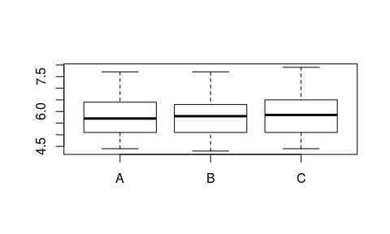
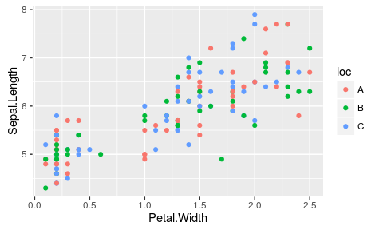
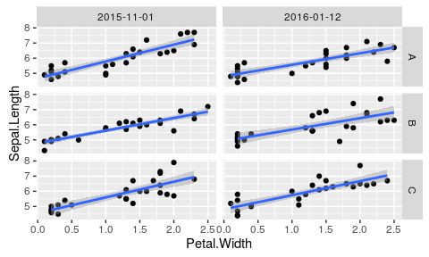

# Introduction to programming with R
Boris Reiss  
  

## Overview of the lab

- Background on programming 
- R concepts
- Exercise: Basic data analysis
- Help

## Programming (Wikipedia)

- Formulation of a problem that leads to a program

Tasks: 

- analysis, 
- developing understanding of the problem, 
- generating algorithm, 
- verification of algorithm, and 
- implementation (coding)  

Purpose: 

- Find a sequence of instructions (algorithm) that will automate performing a specific task to solve a problem

## Remember

- Programming is something you do and not something you know. 

- It requires active practice. (Reading is not an active practice.)

## Programming structures


```r
Variables: 
- numeric, character, factor...

Control Structures: 
- if(), ifelse(), while(), for()...

Data Structures: 
- data.frame, class, matrix...

Syntax: 
- set of rules that defines the correct combinations of symbols
in that language

Tools:   
- library, functions...
```


## R

- R is a statistical programming language and a super advanced calculator
- &gt; 2 million users
- based on functions that can be expanded through packages
- someone has already solved your problem: install.packages()
- it is an interpreter language each command is executed in the console
- "uses vectors to store data" 

## Help

help()

[reference cards](https://www.google.com/search?q=r+reference+card)

books: 

- Beginning Data Science with R by Manas A. Pathak ([free at UW](http://alliance-primo.hosted.exlibrisgroup.com/UW:all:CP71215329450001451))

- The Art of R Programming: A Tour of Statistical Software Design N. Matloff ([free at UW](http://alliance-primo.hosted.exlibrisgroup.com/UW:CP71185032870001451))


## Function

- some INPUT - computation - some OUTPUT

- e.g. log10(): 10^3 = 1000 

- Thus log10(1000)=3

## Helper functions 


```r
help()
example()
c()
data.frame()
head();tail()
table()
summary()
str()
unique()
length()
subset()

assign:
  to <- from
  a <- 5
```

## Make your own function


```r
invmean <- function(data)
{
  
  rslt <- 1/mean(data)
  return(rslt)
}
```

## Important functions


```r
apply()

sapply()

lapply()

by()

%in%

reshape()
```


## Workflow of a typical program

- get 
- review 
- clean 
- restructure
- summarize 
- analyse
- present results

## Getting data

* External
* Internal
    + Existing
    + New
* Simulations

## External 


```r
read.csv() # won't work with a lot of EU data
read.tsv() 
read.table()
read.xlsx() # requires foreign package
```

## Internal


```r
# Existing
data()

# create
c()
seq()

#simulation - distributions
rnorm(); rlnorm(); runif()
```

## Variables


```r
#1-D
as.factor()
as.numeric()
as.character()

# multi-D
c()
as.data.frame()
as.list()
as.matrix()

data.table() # -> through external package
```

## Special variable: time


```r
# time

as.POSIXct()
as.POSIXlt()

# packages: lubridate, chron
```

## Always use ISO time format

- 2015-01-12 23:17:12
- yyyy-mm-dd hh:mm:ss
- may include timezone

## Exercise

## Always start with a clean work space


```r
rm(list=ls())
library(ggplot2)
library(doBy)
```

```
## Loading required package: survival
```

## Get data


```r
data()

data(iris)

#current <- getwd()
#setwd(newdir)

dt <- iris

write.csv(dt, file = "irisdata.csv")
```

## Read the data back


```r
read.csv(file = "irisdata.csv", sep = ",", nrows=5)
```

```
##   X Sepal.Length Sepal.Width Petal.Length Petal.Width Species
## 1 1          5.1         3.5          1.4         0.2  setosa
## 2 2          4.9         3.0          1.4         0.2  setosa
## 3 3          4.7         3.2          1.3         0.2  setosa
## 4 4          4.6         3.1          1.5         0.2  setosa
## 5 5          5.0         3.6          1.4         0.2  setosa
```

## Review


```r
head(dt); tail(dt)
```

```
##   Sepal.Length Sepal.Width Petal.Length Petal.Width Species
## 1          5.1         3.5          1.4         0.2  setosa
## 2          4.9         3.0          1.4         0.2  setosa
## 3          4.7         3.2          1.3         0.2  setosa
## 4          4.6         3.1          1.5         0.2  setosa
## 5          5.0         3.6          1.4         0.2  setosa
## 6          5.4         3.9          1.7         0.4  setosa
```

```
##     Sepal.Length Sepal.Width Petal.Length Petal.Width   Species
## 145          6.7         3.3          5.7         2.5 virginica
## 146          6.7         3.0          5.2         2.3 virginica
## 147          6.3         2.5          5.0         1.9 virginica
## 148          6.5         3.0          5.2         2.0 virginica
## 149          6.2         3.4          5.4         2.3 virginica
## 150          5.9         3.0          5.1         1.8 virginica
```

## Review


```r
str(dt)
```

```
## 'data.frame':	150 obs. of  5 variables:
##  $ Sepal.Length: num  5.1 4.9 4.7 4.6 5 5.4 4.6 5 4.4 4.9 ...
##  $ Sepal.Width : num  3.5 3 3.2 3.1 3.6 3.9 3.4 3.4 2.9 3.1 ...
##  $ Petal.Length: num  1.4 1.4 1.3 1.5 1.4 1.7 1.4 1.5 1.4 1.5 ...
##  $ Petal.Width : num  0.2 0.2 0.2 0.2 0.2 0.4 0.3 0.2 0.2 0.1 ...
##  $ Species     : Factor w/ 3 levels "setosa","versicolor",..: 1 1 1 1 1 1 1 1 1 1 ...
```

## Review


```r
summary(dt)
```

```
##   Sepal.Length    Sepal.Width     Petal.Length    Petal.Width   
##  Min.   :4.300   Min.   :2.000   Min.   :1.000   Min.   :0.100  
##  1st Qu.:5.100   1st Qu.:2.800   1st Qu.:1.600   1st Qu.:0.300  
##  Median :5.800   Median :3.000   Median :4.350   Median :1.300  
##  Mean   :5.843   Mean   :3.057   Mean   :3.758   Mean   :1.199  
##  3rd Qu.:6.400   3rd Qu.:3.300   3rd Qu.:5.100   3rd Qu.:1.800  
##  Max.   :7.900   Max.   :4.400   Max.   :6.900   Max.   :2.500  
##        Species  
##  setosa    :50  
##  versicolor:50  
##  virginica :50  
##                 
##                 
## 
```

## Review


```r
unique(dt$Species)
```

```
## [1] setosa     versicolor virginica 
## Levels: setosa versicolor virginica
```

## Review


```r
table(dt$Species)
```

```
## 
##     setosa versicolor  virginica 
##         50         50         50
```

## Review


```r
nrow(dt) 
```

```
## [1] 150
```


## Create some data


```r
dt$LLOD <- ifelse(dt$Sepal.Length < 5, "y", "n")

str(dt)
```

```
## 'data.frame':	150 obs. of  6 variables:
##  $ Sepal.Length: num  5.1 4.9 4.7 4.6 5 5.4 4.6 5 4.4 4.9 ...
##  $ Sepal.Width : num  3.5 3 3.2 3.1 3.6 3.9 3.4 3.4 2.9 3.1 ...
##  $ Petal.Length: num  1.4 1.4 1.3 1.5 1.4 1.7 1.4 1.5 1.4 1.5 ...
##  $ Petal.Width : num  0.2 0.2 0.2 0.2 0.2 0.4 0.3 0.2 0.2 0.1 ...
##  $ Species     : Factor w/ 3 levels "setosa","versicolor",..: 1 1 1 1 1 1 1 1 1 1 ...
##  $ LLOD        : chr  "n" "y" "y" "y" ...
```

```r
table(dt$LLOD)
```

```
## 
##   n   y 
## 128  22
```

## Create contextual data: location, date, rain


```r
location <- c("A", "B", "C")

date <- c("2015-11-01", "2016-01-12")

rain <- c("lots", "some", "little", "no", "NA")
```


## Modify


```r
dt$loc <- rep(location, 150 / 3)

dt$date <- rep(sample(date), 150 / 2)

dt$rain <- rep(rain, nrow(dt) / length(rain))

dt$rh <- runif(150, min = 37, max = 75)
```

## Modify


```r
str(dt)
```

```
## 'data.frame':	150 obs. of  10 variables:
##  $ Sepal.Length: num  5.1 4.9 4.7 4.6 5 5.4 4.6 5 4.4 4.9 ...
##  $ Sepal.Width : num  3.5 3 3.2 3.1 3.6 3.9 3.4 3.4 2.9 3.1 ...
##  $ Petal.Length: num  1.4 1.4 1.3 1.5 1.4 1.7 1.4 1.5 1.4 1.5 ...
##  $ Petal.Width : num  0.2 0.2 0.2 0.2 0.2 0.4 0.3 0.2 0.2 0.1 ...
##  $ Species     : Factor w/ 3 levels "setosa","versicolor",..: 1 1 1 1 1 1 1 1 1 1 ...
##  $ LLOD        : chr  "n" "y" "y" "y" ...
##  $ loc         : chr  "A" "B" "C" "A" ...
##  $ date        : chr  "2015-11-01" "2016-01-12" "2015-11-01" "2016-01-12" ...
##  $ rain        : chr  "lots" "some" "little" "no" ...
##  $ rh          : num  52.2 59.8 63.9 37.8 70.5 ...
```

## Summarize


```r
aggregate(Sepal.Length ~ loc + date, data = dt, FUN = "mean")
```

```
##   loc       date Sepal.Length
## 1   A 2015-11-01        5.712
## 2   B 2015-11-01        5.900
## 3   C 2015-11-01        5.908
## 4   A 2016-01-12        5.972
## 5   B 2016-01-12        5.744
## 6   C 2016-01-12        5.824
```

## Summarize


```r
tbltst <-
  aggregate(cbind(Sepal.Length,rh) ~ loc + date + rain, 
            data = subset(dt, LLOD != "n"), FUN = "mean")
head(tbltst)
```

```
##   loc       date   rain Sepal.Length       rh
## 1   A 2015-11-01 little          4.6 55.21379
## 2   B 2015-11-01 little          4.6 44.82429
## 3   C 2015-11-01 little          4.7 63.90940
## 4   A 2016-01-12 little          4.9 51.50577
## 5   B 2016-01-12 little          4.9 55.16517
## 6   C 2016-01-12 little          4.6 42.04769
```

## Summarize


```r
tblsdt <-
  summaryBy(Sepal.Length ~ loc + date + rain,
            data = dt, FUN = c(mean, sd))
head(tblsdt)
```

```
##   loc       date   rain Sepal.Length.mean Sepal.Length.sd
## 1   A 2015-11-01 little              5.80       1.1467345
## 2   A 2015-11-01   lots              5.46       0.8443933
## 3   A 2015-11-01     NA              5.84       0.7829432
## 4   A 2015-11-01     no              5.94       0.5128353
## 5   A 2015-11-01   some              5.52       0.5805170
## 6   A 2016-01-12 little              6.12       1.1189281
```

## Summarize


```r
colnames(tblsdt) <- c("lc", "dt", "rn", "msl", "sdsl")
str(tblsdt)
```

```
## 'data.frame':	30 obs. of  5 variables:
##  $ lc  : chr  "A" "A" "A" "A" ...
##  $ dt  : chr  "2015-11-01" "2015-11-01" "2015-11-01" "2015-11-01" ...
##  $ rn  : chr  "little" "lots" "NA" "no" ...
##  $ msl : num  5.8 5.46 5.84 5.94 5.52 6.12 6.48 5.7 5.5 6.06 ...
##  $ sdsl: num  1.147 0.844 0.783 0.513 0.581 ...
```

## Basic plots


```r
boxplot(Sepal.Length ~ loc,data = dt)
```




## ggplot: The beauty of plotting


```r
p <- ggplot(dt)

p <- p + geom_point(aes(x = Petal.Width, y = Sepal.Length, 
                        color = loc))
```

## ggplot: The beauty of plotting


```r
p
```




## ggplot: The beauty of plotting


```r
p <- ggplot(dt, aes(x = Petal.Width , y = Sepal.Length))

p <- p + geom_point()

p <- p + geom_smooth(method = "lm", se = T)

p <- p + facet_grid(loc ~ date)
```

## ggplot: The beauty of plotting


```r
p
```




## Analysis


```r
lm(Sepal.Length ~ loc + date + rain, data = tbltst)
```

```
## 
## Call:
## lm(formula = Sepal.Length ~ loc + date + rain, data = tbltst)
## 
## Coefficients:
##    (Intercept)            locB            locC  date2016-01-12  
##        4.71104         0.02826        -0.10744         0.06404  
##       rainlots          rainNA          rainno        rainsome  
##        0.05694         0.10173        -0.29401         0.03217
```

## Analysis


```r
lf <- lm(Sepal.Length ~ loc + date + rain, data = tbltst)
```

## Analysis


```r
summary(lf)
```

```
## 
## Call:
## lm(formula = Sepal.Length ~ loc + date + rain, data = tbltst)
## 
## Residuals:
##      Min       1Q   Median       3Q      Max 
## -0.20934 -0.06850  0.02318  0.09341  0.12853 
## 
## Coefficients:
##                Estimate Std. Error t value Pr(>|t|)    
## (Intercept)     4.71104    0.07608  61.920 2.41e-15 ***
## locB            0.02826    0.07780   0.363  0.72329    
## locC           -0.10744    0.08074  -1.331  0.21018    
## date2016-01-12  0.06404    0.06127   1.045  0.31835    
## rainlots        0.05694    0.11691   0.487  0.63581    
## rainNA          0.10173    0.08590   1.184  0.26125    
## rainno         -0.29401    0.09383  -3.133  0.00952 ** 
## rainsome        0.03217    0.08590   0.374  0.71516    
## ---
## Signif. codes:  0 '***' 0.001 '**' 0.01 '*' 0.05 '.' 0.1 ' ' 1
## 
## Residual standard error: 0.1319 on 11 degrees of freedom
## Multiple R-squared:  0.6637,	Adjusted R-squared:  0.4498 
## F-statistic: 3.102 on 7 and 11 DF,  p-value: 0.04582
```

## Presentation

* [RMarkdown](http://rmarkdown.rstudio.com/)
* [knitr](http://yihui.name/knitr/)
