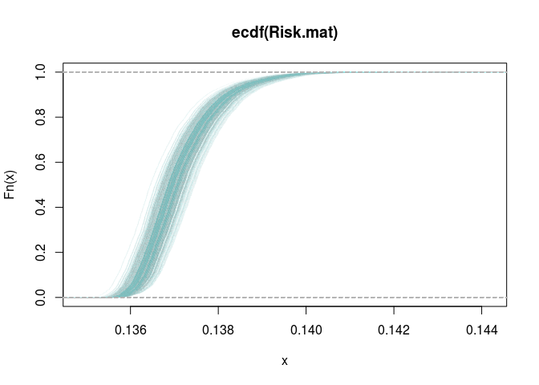
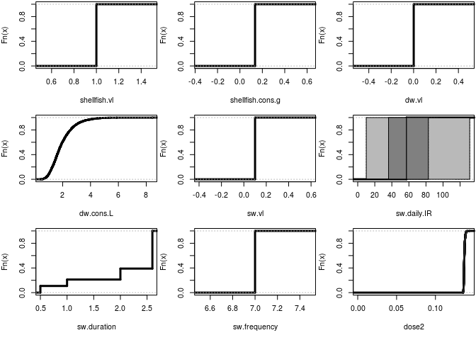

# 2-D Monte Carlo simulation of microbial exposure
Jane Pouzou and Brian High  
  

## Introduction

This document offers two 2-D Monte Carlo probabilistic solutions in R for the 
daily microbial exposure from drinking water consumption, swimming in surface 
water and shellfish consumption for [Example 6.18](images/ex0618.png) from 
pages 215-216 of:

[Quantitative Microbial Risk Assessment, 2nd Edition](http://www.wiley.com/WileyCDA/WileyTitle/productCd-1118145291,subjectCd-CH20.html) 
by Charles N. Haas, Joan B. Rose, and Charles P. Gerba. (Wiley, 2014).

The first solution is coded manually with functionality built into "base" R.

The second solution uses the _mc2d_ package.

## Set global options


```r
# Set display options for use with the print() function.
options(digits = 5)

# Set knitr options for use when rendering this document.
library("knitr")
opts_chunk$set(cache=TRUE, message=FALSE)
```

## Perform a 2-D Monte Carlo simulation

### Define variables


```r
# Define the deterministic factors.
shellfish.viral.load  <- 1        # Shellfish viral loading (viruses/g)
dw.viral.load         <- 0.001    # Drinking water viral loading (viruses/L)
shellfish.cons.g      <- 0.135    # Shellfish consumption (viruses/day)
sw.viral.load         <- 0.1      # Swimming in viral loading (viruses/L)
sw.frequency          <- 7        # Swimming frequency (swims/year)

# Define an integer to use when setting the seed of the random number generator.
seed <- 1

# Define the number of samples for the variability and uncertainty dimensions.
nsv <- 250
nsu <- 5000
```

### Sample from distributions reflecting variability 

For the variability dimension, generate 250 random samples from a normal 
distribution to estimate ingestion rate (IR) in mL of surface water while
swimming. The standard deviation value of 45 used here is a fictitious example.


```r
set.seed(seed)
sw.d.IR <- rnorm(nsv, mean = 50, sd = 45)
```

Plot the kernel density estimates for surface water ingestion rate.


```r
plot(density(sw.d.IR))
```

 

### Define exposure risk function

Define a risk function to calculate estimated microbial exposure.


```r
Risk.fcn <- function(shellfish.vl, shellfish.cons.g, water.cons.L, dw.vl, 
                     sw.vl, sw.daily.IR, sw.duration, sw.frequency) {
    ((shellfish.vl * shellfish.cons.g) + (water.cons.L * dw.vl) + 
         ((sw.vl * (sw.daily.IR * sw.duration * sw.frequency)) / 365 / 1000))
}
```

### Run a 2-D MC simulation

Run the simulation using a nested loop structure of 5000 iterations (in the 
uncertainty dimension) performed by the `sapply()` function for each of 250 
iterations (in the varibility dimension) of a `for()` loop.

Specifically, within the `for()` loop:

- Sample from the distributions reflecting uncertainty:
    1. Drinking water consumption in liters/day (log-normal distribution)
    2. Swimming duration in hours (discrete distribution)
- Compute 5000 daily exposure estimates and store as a vector in a matrix.

The results of each iteration will be accumulated in a 5000 row by 250 column 
matrix. 


```r
# Define an empty matrix to hold the simulation results.
Risk.mat <- matrix(as.numeric(NA), nrow = nsu, ncol = nsv)

for (i in 1:nsv) {
    # 1. Generate 5000 random samples from a log-normal distribution to estimate 
    #    exposure from consumption of drinking water (ml/day). Divide by 1000 
    #    mL/L to get consumption in liters/day.  Values for meanlog and sdlog 
    #    are from the QMRA textbook (Haas et al. 2014), page 216, Table 6.30.
    set.seed(seed)
    water.cons.L <- rlnorm(n = nsu, meanlog = 7.49, sdlog = 0.407) / 1000
    
    # 2. Sample 5000 times from a discrete distribution of swim duration with 
    #    assigned probabilities of each outcome. These values are hypothetical 
    #    and are not found in the text, but are defined here to provide an 
    #    example of sampling from a discrete distribution.
    set.seed(seed)
    swim.duration <- sample(x = c(0.5, 1, 2, 2.6), size = nsu, 
                            replace = TRUE, prob = c(0.1, 0.1, 0.2, 0.6))
    
    # Compute 5000 daily simulations and store as a vector in a matrix.
    Risk.mat[,i] <- sapply(1:nsu, function(j) 
        # Define a function to calculate esimated microbial exposure risk.
        Risk.fcn(water.cons.L = water.cons.L[j],
                 sw.duration = swim.duration[j],
                 shellfish.vl = shellfish.viral.load,
                 dw.vl = dw.viral.load,
                 shellfish.cons.g = shellfish.cons.g,
                 sw.vl = sw.viral.load,
                 sw.daily.IR = sw.d.IR[i],
                 sw.frequency = sw.frequency))
}
```

### Summarize results

We will build up an empirical cumulative distribution plot of all of the loop
iterations, by overlaying each new curve over a plot of the first iteration.


```r
# Plot the empirical cumulative distribution for the first iteration.
plot(ecdf(Risk.mat[, 1]), col = "#ADD8E605", main = 'ecdf(Risk.mat)')

# Plot empirical cumulative distributions for additional iterations in blue.
for (j in 2:nsv) {
    plot(ecdf(Risk.mat[, j]), col = "#ADD8E605", add = TRUE)
}
```

 

## Repeat the simulation with mc2d

We will demonstrate two alternative ways to run 2-dimensional Monte Carlo 
simulation using the 
[mc2d](https://cran.r-project.org/web/packages/mc2d/index.html) package.

For our first alternative, we will use 
[mcmodel](http://www.inside-r.org/packages/cran/mc2d/docs/mcmodel) and 
[evalmcmod](http://www.inside-r.org/packages/cran/mc2d/docs/evalmcmod) from 
the [mc2d](https://cran.r-project.org/web/packages/mc2d/index.html) package. 
This is a simple way to implement the 2-D simulation because we just need to
define the model with `mcmodel()` and evaluate it with `evalmcmod()`.

### Load packages

Make sure the _mc2d_ package is installed before trying to use it. If we just 
tried to load it with `library()` or `require()` before it had been installed, 
our program would end with errors. (That would not be very friendly.)


```r
# Define a function to conditionally install and load a package.
load.pkg <- function(pkg) {
    if (! suppressWarnings(require(pkg, character.only = TRUE)) ) {
        install.packages(pkg, repos = 'http://cran.r-project.org')
        library(pkg, character.only = TRUE, quietly = TRUE)
    }
}

# Load required packages, installing first if necessary.
suppressMessages(load.pkg("mc2d"))   # Or just use: library(mc2d)
```

### Define exposure model

Within the [mcmodel](http://www.inside-r.org/packages/cran/mc2d/docs/mcmodel)
function, use [mcstoc](http://www.inside-r.org/packages/cran/mc2d/docs/mcstoc)
to define "mc nodes" for each component of the model. 

For each "mc node", supply a probability function, the node type as "V" for 
variability or "U" for uncertainty, and any additional parameters to be passed 
to the probability function. 

Other node types ("VU" and "0") are also available, but we will not be using 
them in this example. See the 
[mcstoc documentation](http://www.inside-r.org/packages/cran/mc2d/docs/mcstoc)
for details.

We will model the deterministic factors as uniform probablity distributions.

The last statement makes an "mc" object using the 
[mc](http://www.inside-r.org/packages/cran/mc2d/docs/mc) function.


```r
# Define an exposure model for evaluation by evalmcmod().
expo.mod1 <- mcmodel({
    # Values from Example 6.18 from Quantitative Microbial Risk Assessment, 
    # 2nd Edition by Charles N. Haas, Joan B. Rose, and Charles P. Gerba. 
    # (Wiley, 2014), pp. 215-216. Other fictitious values are noted below.
    
    # Shellfish viral loading (viruses/g):
    shellfish.vl = mcstoc(runif, type = "V", min = 1, max = 1)
    
    # Shellfish consumption (g/day):
    shellfish.cons.g = mcstoc(runif, type = "V", min = 0.135, max = 0.135)
    
    # Drinking water viral loading (viruses/L):
    dw.vl = mcstoc(runif, type = "V", min = 0.001, max = 0.001)
    
    # Drinking water consumption (L/day):
    dw.cons.L = mcstoc(rlnorm, type = "V", 
                       meanlog = 7.49, sdlog = 0.407) / 1000
    
    # Swimming in surface water viral loading (viruses/L):
    sw.vl = mcstoc(runif, type = "V", min = 0.1, max = 0.1)
    
    # Swimming daily ingestion rate (mL/hour): fictitious sd = 45
    sw.daily.IR = mcstoc(rnorm, type = "U", mean = 50, sd = 45, 
                         rtrunc = TRUE, linf = 0)
    
    # Swimming duration (hours): fictitious discrete distribution
    sw.duration = mcstoc(rempiricalD, type = "V", 
                         values = c(0.5, 1, 2, 2.6), 
                         prob = c(0.1, 0.1, 0.2, 0.6))
    
    # Swimming frequency (swims/year):
    sw.frequency = mcstoc(runif, type = "V", min = 7, max = 7)
    
    # Create an mc object to estimate microbial exposure.
    mc((shellfish.vl * shellfish.cons.g) + (dw.vl * dw.cons.L) + 
           ((sw.vl * (sw.daily.IR * sw.duration * sw.frequency)) / 365 / 1000))
})
```

### Evaluate the model

Evaluate the model with 5000 iterations in the variability dimension and 250 
iterations in the uncertainty dimension.


```r
expo.ev1 <- evalmcmod(expo.mod1, nsv = 5000, nsu = 250, seed = 1)
expo.ev1
```

```
##   node    mode  nsv nsu nva variate   min  mean median   max Nas type outm
## 1      numeric 5000 250   1       1 0.135 0.137  0.137 0.144   0   VU each
```

### Summarize results

Print the evaluation results and plot the empirical cumulative distribution.


```r
# Summarize the results.
summary(expo.ev1)
```

```
##  :
##         mean       sd   Min  2.5%   25%   50%   75% 97.5%   Max  nsv Na's
## median 0.137 0.000847 0.136 0.136 0.137 0.137 0.138 0.139 0.144 5000    0
## mean   0.137 0.000849 0.136 0.136 0.137 0.137 0.138 0.139 0.144 5000    0
## 2.5%   0.137 0.000841 0.135 0.136 0.136 0.137 0.137 0.139 0.143 5000    0
## 97.5%  0.138 0.000867 0.136 0.136 0.137 0.137 0.138 0.140 0.144 5000    0
```

```r
# Generate an "ecdf" plot.
plot(expo.ev1)
```

 

## Repeat 2-D simulation again with a loop

This time we will use another pair of functions from the 
[mc2d](https://cran.r-project.org/web/packages/mc2d/index.html) 
package, `mcmodelcut()` and `evalmccut()`, to get a different 
style of summary output. They implement the uncertainty dimension of the 
2-D simulation with a processing _loop_.

By using these [mccut](http://www.inside-r.org/packages/cran/mc2d/docs/mccut) 
functions, we will also be able to conserve system memory, at the cost of 
taking more time to perform the simulation. This approach allows the evaluation 
of very high dimensional models on relatively modest computer systems.

### Load packages


```r
# Load packages.
library(mc2d)
```

### Define exposure model

The `mcmodelcut()` function expects its input in three blocks:

```
mcmodelcut(
    { 
        # Block 1: evaluated once before the first loop (step 1)
        { 
            # Evaluate all of the 0, V and U mc node objects.
        } 
        # Block 2: evaluated using nsu = 1 (step 2)
        { 
            # Evaluate all of the VU nodes. Last statement makes an mc object.
        } 
        # Block 3: repeated nsu times (step 3)
        { 
            # Build a list of statistics refering to the mc object.
        } 
    })
```

... where `nsu` is the number of simulations for uncertainty used in the 
evaluation.


```r
# Build a mcmodelcut object in three blocks for evaluation by evalmccut().
expo.mcmcut <- mcmodelcut({
    # Block 1: Evaluate all of the 0, V and U mc node objects.
    {
        # Values from Example 6.18 from Quantitative Microbial Risk Assessment, 
        # 2nd Edition by Charles N. Haas, Joan B. Rose, and Charles P. Gerba. 
        # (Wiley, 2014), pp. 215-216. Other fictitious values are noted below.
        
        # Shellfish viral loading (viruses/g):
        shellfish.vl = mcstoc(runif, type = "V", min = 1, max = 1)
        
        # Shellfish consumption (g/day):
        shellfish.cons.g = mcstoc(runif, type = "V", min = 0.135, max = 0.135)
        
        # Drinking water viral loading (viruses/L):
        dw.vl = mcstoc(runif, type = "V", min = 0.001, max = 0.001)
        
        # Drinking water consumption (L/day):
        dw.cons.L = mcstoc(rlnorm, type = "V", 
                           meanlog = 7.49, sdlog = 0.407) / 1000
        
        # Swimming in surface water viral loading (viruses/L):
        sw.vl = mcstoc(runif, type = "V", min = 0.1, max = 0.1)
        
        # Swimming daily ingestion rate (mL/hour): fictitious sd = 45
        sw.daily.IR = mcstoc(rnorm, type = "U", mean = 50, sd = 45, 
                             rtrunc = TRUE, linf = 0)
        
        # Swimming duration (hours): fictitious discrete distribution
        sw.duration = mcstoc(rempiricalD, type = "V", 
                             values = c(0.5, 1, 2, 2.6), 
                             prob = c(0.1, 0.1, 0.2, 0.6))
        
        # Swimming frequency (swims/year):
        sw.frequency = mcstoc(runif, type = "V", min = 7, max = 7)
    }
    
    # Block2: Evaluate all of the VU nodes. Last statement makes an mc object.
    {
        # Estimate the exposure using the V and U nodes to create a VU node.
        expo.mc <- (shellfish.vl * shellfish.cons.g) + (dw.vl * dw.cons.L) + 
            ((sw.vl * (sw.daily.IR * sw.duration * sw.frequency)) / 365 / 1000)
   
        # Build a mc model from all of the mcnode objects.
        expo.mod2 <- mc(shellfish.vl, shellfish.cons.g, dw.vl, dw.cons.L, 
                        sw.vl, sw.daily.IR, sw.duration, sw.frequency, expo.mc)
    }

    # Block 3: Build a list of statistics refering to the mc object.
    {
        list(sum = summary(expo.mod2), plot = plot(expo.mod2, draw = FALSE))
    }

})
```

```
## The following expression will be evaluated only once :
## {
##     shellfish.vl = mcstoc(runif, type = "V", min = 1, max = 1)
##     shellfish.cons.g = mcstoc(runif, type = "V", min = 0.135, 
##         max = 0.135)
##     dw.vl = mcstoc(runif, type = "V", min = 0.001, max = 0.001)
##     dw.cons.L = mcstoc(rlnorm, type = "V", meanlog = 7.49, sdlog = 0.407)/1000
##     sw.vl = mcstoc(runif, type = "V", min = 0.1, max = 0.1)
##     sw.daily.IR = mcstoc(rnorm, type = "U", mean = 50, sd = 45, 
##         rtrunc = TRUE, linf = 0)
##     sw.duration = mcstoc(rempiricalD, type = "V", values = c(0.5, 
##         1, 2, 2.6), prob = c(0.1, 0.1, 0.2, 0.6))
##     sw.frequency = mcstoc(runif, type = "V", min = 7, max = 7)
## }
## The mc object is named:  expo.mod2
```

### Evaluate the model

Evaluate the model with 5000 iterations in the variability dimension and 250 
iterations in the uncertainty dimesion.


```r
# Capture the text output and print when finished to save space in the report.
capture.output(x <- evalmccut(expo.mcmcut, nsv = 5000, nsu = 250, seed = 1))
```

```
## [1] "'0' mcnode(s) built in the first block:  "                                                                            
## [2] "'V' mcnode(s) built in the first block: dw.cons.L dw.vl shellfish.cons.g shellfish.vl sw.duration sw.frequency sw.vl "
## [3] "'U' mcnode(s) built in the first block: sw.daily.IR "                                                                 
## [4] "'VU' mcnode(s) built in the first block:  "                                                                           
## [5] "The 'U' and 'VU' nodes will be sent column by column in the loop"                                                     
## [6] "---------|---------|---------|---------|---------|"                                                                   
## [7] "**************************************************"
```

### Summarize results

Print the accumulated statistics with `summary()` and `plot()`.


```r
# Print a summary and a plot for the mccut object.
summary(x)
```

```
## shellfish.vl :
##       mean sd Min 2.5% 25% 50% 75% 97.5% Max  nsv Na's
## NoUnc    1  0   1    1   1   1   1     1   1 5000    0
## 
## shellfish.cons.g :
##        mean sd   Min  2.5%   25%   50%   75% 97.5%   Max  nsv Na's
## NoUnc 0.135  0 0.135 0.135 0.135 0.135 0.135 0.135 0.135 5000    0
## 
## dw.vl :
##        mean sd   Min  2.5%   25%   50%   75% 97.5%   Max  nsv Na's
## NoUnc 0.001  0 0.001 0.001 0.001 0.001 0.001 0.001 0.001 5000    0
## 
## dw.cons.L :
##       mean    sd   Min  2.5%  25%  50%  75% 97.5%  Max  nsv Na's
## NoUnc 1.95 0.841 0.402 0.776 1.36 1.78 2.38  4.07 8.44 5000    0
## 
## sw.vl :
##       mean sd Min 2.5% 25% 50% 75% 97.5% Max  nsv Na's
## NoUnc  0.1  0 0.1  0.1 0.1 0.1 0.1   0.1 0.1 5000    0
## 
## sw.daily.IR :
##       NoVar
## 50%    57.8
## mean   60.9
## 2.5%    4.5
## 97.5% 137.3
## Nas     0.0
## 
## sw.duration :
##       mean    sd Min 2.5% 25% 50% 75% 97.5% Max  nsv Na's
## NoUnc 2.11 0.726 0.5  0.5   2 2.6 2.6   2.6 2.6 5000    0
## 
## sw.frequency :
##       mean sd Min 2.5% 25% 50% 75% 97.5% Max  nsv Na's
## NoUnc    7  0   7    7   7   7   7     7   7 5000    0
## 
## expo.mc :
##        mean       sd   Min  2.5%   25%   50%   75% 97.5%   Max  nsv Na's
## 50%   0.137 0.000847 0.136 0.136 0.137 0.137 0.138 0.139 0.144 5000    0
## mean  0.137 0.000849 0.136 0.136 0.137 0.137 0.138 0.139 0.144 5000    0
## 2.5%  0.137 0.000841 0.135 0.136 0.136 0.137 0.137 0.139 0.143 5000    0
## 97.5% 0.138 0.000867 0.136 0.136 0.137 0.137 0.138 0.140 0.144 5000    0
## Nas   0.000 0.000000 0.000 0.000 0.000 0.000 0.000 0.000 0.000    0    0
```

```r
plot(x)
```

 

Plot the empirical cumulative distribution for the estimated exposure. To match
the `ecdf` plot made earlier, we will construct the plot elements manually.


```r
expo.x <- x$plot$expo.mc
expo.l <- length(expo.x)
expo.y <- 1:expo.l/expo.l
plot(expo.x, expo.y, pch = 20, cex = 0.1, col = '#ADD8E604', 
     main='ecdf(expo.mc)', ylab = 'Fn(x)', xlab = 'x')
abline(h = 0, col = "gray", lty = 2, lwd = 2)
abline(h = 1, col = "gray", lty = 2, lwd = 2)
```

 
