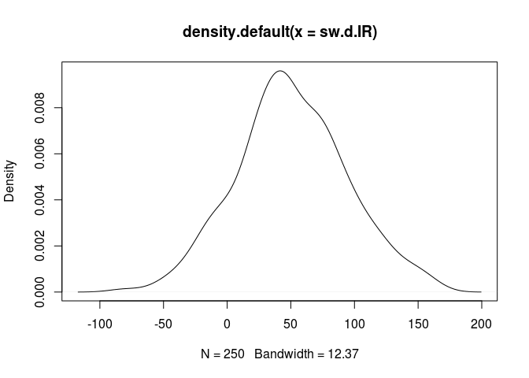
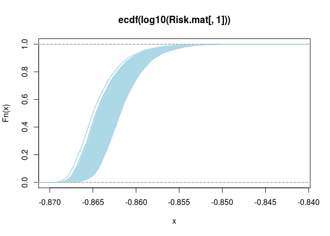
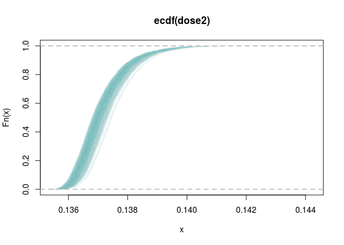

# 2-D Monte Carlo simulation of microbial exposure
Jane Pouzou  
License: CC BY-SA 4.0  

This document offers a 2-D Monte Carlo probabilistic solution in R for the 
daily microbial exposure from drinking water consumption, swimming in surface 
water and shellfish consumption for [Example 6.18](images/ex0618.png) from 
pages 215-216 of:

[Quantitative Microbial Risk Assessment, 2nd Edition](http://www.wiley.com/WileyCDA/WileyTitle/productCd-1118145291,subjectCd-CH20.html) 
by Charles N. Haas, Joan B. Rose, and Charles P. Gerba. (Wiley, 2014).


```r
# A 2-D Monte Carlo simulation for the daily microbial exposure from drinking
# water consumption, swimming in surface water, and shellfish consumption
# for Example 6.18 from Quantitative Microbial Risk Assessment, 2nd Edition
# by Charles N. Haas, Joan B. Rose, and Charles P. Gerba. (Wiley, 2014).

# Copyright (c) Jane Pouzou
# License: CC BY-SA 4.0 - https://creativecommons.org/licenses/by-sa/4.0/

# ---------------------------------------------------------------------
# Clear workspace
# ---------------------------------------------------------------------

# Clear the workspace, unless you are running in knitr context.
if (!isTRUE(getOption('knitr.in.progress'))) {
    closeAllConnections()
    rm(list = ls())
}

# ---------------------------------------------------------------------
# Set options
# ---------------------------------------------------------------------

# Set display options for use with the print() function.
options(digits = 5)

# ---------------------------------------------------------------------
# Define variables
# ---------------------------------------------------------------------

# Define the deterministic factors.
shell.viral.load <- 1     # Shellfish viral loading (viruses/g)
dw.viral.load <- 0.001    # Drinking water viral loading (viruses/L)
shell.cons <- 0.135       # Shellfish consumption (viruses/day)
sw.viral.load <- 0.1      # Swmming in surface water viral loading (viruses/L)
sw.frequency <- 7         # Swimming frequency (swims/year)

# Define an integer to use when setting the seed of the random number generator.
seed <- 1

# Define a function to calculate estimated exposure risk.
Risk.fcn <- function(shell.vl, shell.cons, water.cons.L, dw.vl, sw.vl,
                     sw.daily.IR, sw.duration, sw.frequency) {
    ((shell.vl * shell.cons) + (water.cons.L * dw.vl) +
       ((sw.vl * (sw.daily.IR * sw.duration * sw.frequency)) / 365 / 1000))
}

# Define an empty matrix to hold the simulation results.
Risk.mat <- matrix(as.numeric(NA), nrow = 5000, ncol = 250)

# ---------------------------------------------------------------------
# Perform a 2-D Monte Carlo simulation
# ---------------------------------------------------------------------

# Generate 250 random samples from a normal distribution to estimate 
# ingestion rate (IR) in mL of surface water. The standard deviation 
# value of 45 used here is a fictitious example.
set.seed(seed)
sw.d.IR <- rnorm(250, mean = 50, sd = 45)

# Plot the kernel density estimates for surface water.
plot(density(sw.d.IR))
```



```r
# Run 250 iterations of a 5000-sample simulation.
for (i in 1:250) {
    # Generate 5000 random samples from a log-normal distribution to estimate 
    # exposure from consumption of drinking water (ml/day). Divide by 1000 
    # mL/L to get consumption in liters/day.  Values for meanlog and sdlog 
    # are from the QMRA textbook (Haas et al. 2014), page 216, Table 6.30.
    set.seed(seed)
    water.cons.L <- rlnorm(n = 5000, meanlog = 7.49, sdlog = 0.407) / 1000
    
    # Plot the kernel density estimates for drinking water.
    #plot(density(water.cons.L))  # Uncomment this if you want to see these.
    
    # Sample 5000 times from a discrete distribution of swim duration with 
    # assigned probabilities of each outcome. These values are hypothetical 
    # and are not found in the text, but are defined here to provide an 
    # example of sampling from a discrete distribution.
    set.seed(seed)
    swim.duration <- sample(x = c(0.5, 1, 2, 2.6), size = 5000, 
                            replace = TRUE, prob = c(0.1, 0.1, 0.2, 0.6))
    
    # Compute 5000 daily dose simulations and store as a vector in a matrix.
    Risk.mat[,i] <- sapply(1:5000, function(j) 
        # Define a function to calculate esimated microbial exposure risk.
        Risk.fcn(water.cons.L = water.cons.L[j],
                 sw.duration = swim.duration[j],
                 shell.vl = shell.viral.load,
                 dw.vl = dw.viral.load,
                 shell.cons = shell.cons,
                 sw.vl = sw.viral.load,
                 sw.daily.IR = sw.d.IR[i],
                 sw.frequency = sw.frequency))
}

# Plot the empirical cumulative distribution for the first iteration.
plot(ecdf(Risk.mat[, 1]), col="#ADD8E605")

# Plot empirical cumulative distributions for additional iterations in blue.
for (j in 1:250) {
    plot(ecdf(Risk.mat[, j]), col="#ADD8E605", add = TRUE)
}
```



```r
# ---------------------------------------------------------------------
# Repeat the simulation with mc2d
# ---------------------------------------------------------------------

# There are multiple ways to run the 2-D simulation depending on the 
# desired output. We will use mc() and mcmodelcut() from the mc2d package.

# Define a function to conditionally install and load a package.
load.pkg <- function(pkg) {
    if (! suppressWarnings(require(pkg, character.only = TRUE)) ) {
        install.packages(pkg, repos = 'http://cran.r-project.org')
        library(pkg, character.only = TRUE, quietly = TRUE)
    }
}

# Load required packages, installing first if necessary.
suppressMessages(load.pkg("mc2d"))
suppressMessages(load.pkg("PBSmodelling"))  # For unpackList()
# Or use library() and take your chances...

# Define an integer to use when setting the seed of the random number generator.
seed <- 1

# Set the number of simulations in the variability dimension.
ndvar(5000)
```

```
## [1] 5000
```

```r
# Set the number of simulations in the uncertainty dimension. 
ndunc(250)
```

```
## [1] 250
```

```r
# Define a function to create mcnode objects for use by mc() and mcmodelcut().
create_mcnode_objects <- function() {
    # Values from Example 6.18 from Quantitative Microbial Risk Assessment, 
    # 2nd Edition by Charles N. Haas, Joan B. Rose, and Charles P. Gerba. 
    # (Wiley, 2014), pp. 215-216. Other fictitious values are noted below.
    
    # Return a list of mcnode objects.
    return(list(
        # Shellfish viral loading (viruses/g):
        shellfish.vl = mcstoc(runif, type = "V", min = 1, max = 1),
        # Shellfish consumption (g/day):
        shellfish.cons.g = mcstoc(runif, type = "V", min = 0.135, max = 0.135),
        # Drinking water viral loading (viruses/L):
        dw.vl = mcstoc(runif, type = "V", min = 0.001, max = 0.001),
        # Drinking water consumption (L/day):
        dw.cons.L = mcstoc(rlnorm, type = "V", meanlog = 7.49, sdlog = 0.407, 
                           seed = seed) / 1000,
        # Swmming in surface water viral loading (viruses/L):
        sw.vl = mcstoc(runif, type = "V", min = 0.1, max = 0.1),
        # Swimming daily ingenstion rate (mL/hour): fictitious sd = 45
        sw.daily.IR = mcstoc(rnorm, type = "U", mean = 50, sd = 45, 
                             seed = seed, rtrunc = TRUE, linf = 0),
        # Swimming duration (hours): fictitious discrete distribution
        sw.duration = mcstoc(rempiricalD, type = "V", 
                             values = c(0.5, 1, 2, 2.6), 
                             prob = c(0.1, 0.1, 0.2, 0.6)),
        # Swimming frequency (swims/year):
        sw.frequency = mcstoc(runif, type = "V", min = 7, max = 7)))
}

# Define a function to estimate exposure risk from mcnode objects.
calc_dose <- function(mcnodes) {
    with(mcnodes, ((shellfish.vl * shellfish.cons.g) + (dw.vl * dw.cons.L) +
       ((sw.vl * (sw.daily.IR * sw.duration * sw.frequency)) / 365 / 1000)))
}

# Create a Monte Carlo object from a set of mcnode objects.
dose1 <- mc(calc_dose(create_mcnode_objects()))

# Plot the Monte Carlo object.
plot(dose1)
```


```r
# Get the item names of the mcnode object list to use with mcmodelcut().
mcnode.names <- names(create_mcnode_objects())

# Build (in three blocks) a mcmodelcut object for evaluation by evalmccut().
dosemccut <- mcmodelcut({
    # Block 1: Evaluate all of the 0, V and U nodes, returning mcnode objects.
    { unpackList(create_mcnode_objects()) }
    
    # Block2: Evaluate all of the VU nodes and return an mc object.
    { dose2 <- calc_dose(mget(mcnode.names))
      dosemod <- do.call(mc, mget(c(mcnode.names, "dose2"))) }

    # Block 3: Return a list of statistics refering to the mc object.
    { list(sum = summary(dosemod), plot = plot(dosemod, draw = FALSE)) }
})
```

```
## The following expression will be evaluated only once :
## {
##     unpackList(create_mcnode_objects())
## }
```

```
## Warning in mcmodelcut({: The last call should be 'mymc <- mc(...)'
```

```
## The mc object is named:  dosemod
```

```r
# Evaluate the 2-D Monte Carlo model using a loop on the uncertainty dimension.
# Capture the text output and print when finished to save space in the report.
capture.output(x <- evalmccut(dosemccut, nsv = 5000, nsu = 250, seed = seed))
```

```
## [1] "'0' mcnode(s) built in the first block:  "                                                                            
## [2] "'V' mcnode(s) built in the first block: dw.cons.L dw.vl shellfish.cons.g shellfish.vl sw.duration sw.frequency sw.vl "
## [3] "'U' mcnode(s) built in the first block: sw.daily.IR "                                                                 
## [4] "'VU' mcnode(s) built in the first block:  "                                                                           
## [5] "The 'U' and 'VU' nodes will be sent column by column in the loop"                                                     
## [6] "---------|---------|---------|---------|---------|"                                                                   
## [7] "**************************************************"
```

```r
# Print a summary and a plot for the mccut object.
summary(x)
```

```
## shellfish.vl :
##       mean sd Min 2.5% 25% 50% 75% 97.5% Max  nsv Na's
## NoUnc    1  0   1    1   1   1   1     1   1 5000    0
## 
## shellfish.cons.g :
##        mean sd   Min  2.5%   25%   50%   75% 97.5%   Max  nsv Na's
## NoUnc 0.135  0 0.135 0.135 0.135 0.135 0.135 0.135 0.135 5000    0
## 
## dw.vl :
##        mean sd   Min  2.5%   25%   50%   75% 97.5%   Max  nsv Na's
## NoUnc 0.001  0 0.001 0.001 0.001 0.001 0.001 0.001 0.001 5000    0
## 
## dw.cons.L :
##       mean    sd   Min  2.5%  25%  50%  75% 97.5%  Max  nsv Na's
## NoUnc 1.95 0.841 0.402 0.776 1.36 1.78 2.38  4.07 8.44 5000    0
## 
## sw.vl :
##       mean sd Min 2.5% 25% 50% 75% 97.5% Max  nsv Na's
## NoUnc  0.1  0 0.1  0.1 0.1 0.1 0.1   0.1 0.1 5000    0
## 
## sw.daily.IR :
##       NoVar
## 50%    57.2
## mean   61.9
## 2.5%   10.0
## 97.5% 131.3
## Nas     0.0
## 
## sw.duration :
##       mean    sd Min 2.5% 25% 50% 75% 97.5% Max  nsv Na's
## NoUnc  2.1 0.745 0.5  0.5   2 2.6 2.6   2.6 2.6 5000    0
## 
## sw.frequency :
##       mean sd Min 2.5% 25% 50% 75% 97.5% Max  nsv Na's
## NoUnc    7  0   7    7   7   7   7     7   7 5000    0
## 
## dose2 :
##        mean       sd   Min  2.5%   25%   50%   75% 97.5%   Max  nsv Na's
## 50%   0.137 0.000844 0.135 0.136 0.137 0.137 0.138 0.139 0.144 5000    0
## mean  0.137 0.000846 0.135 0.136 0.137 0.137 0.138 0.139 0.144 5000    0
## 2.5%  0.137 0.000841 0.135 0.136 0.136 0.137 0.137 0.139 0.143 5000    0
## 97.5% 0.137 0.000860 0.136 0.136 0.137 0.137 0.138 0.140 0.144 5000    0
## Nas   0.000 0.000000 0.000 0.000 0.000 0.000 0.000 0.000 0.000    0    0
```

```r
plot(x)
```


```r
# Plot the empirical cumulative distribution for the estimated exposure.
expo.x <- x$plot$dose2
expo.l <- length(expo.x)
expo.y <- 1:expo.l/expo.l
plot(expo.x, expo.y, pch = 20, cex = 0.1, col='#ADD8E604', 
     main='ecdf(dose2)', ylab = 'Fn(x)', xlab = 'x')
abline(h = 0, col = "gray", lty = 2, lwd = 2)
abline(h = 1, col = "gray", lty = 2, lwd = 2)
```


