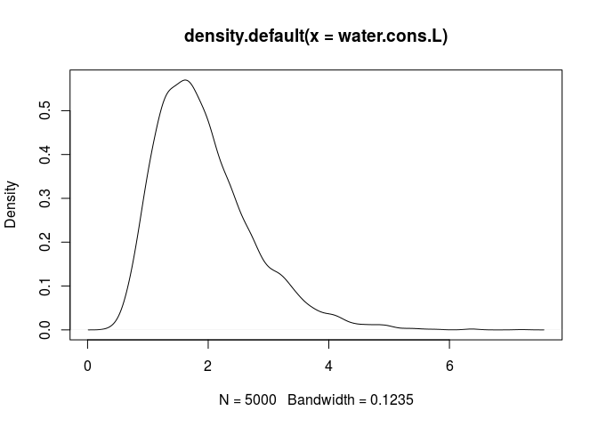
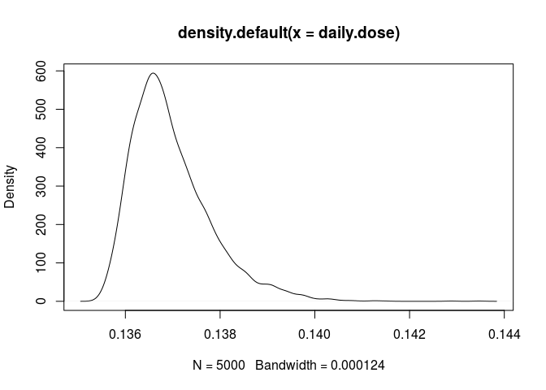

# Probabilistic simulation of microbial exposure
Jane Pouzou  
License: CC BY-SA 4.0  

This document offers a probabilistic solution in R for the daily microbial 
exposure from drinking water consumption for [Example 6.18](https://books.google.com/books?id=ejTKAwAAQBAJ&lpg=PT265&ots=6q9TSELe3B&pg=PT265#v=onepage&q&f=false) from pages 215-216 of:

[Quantitative Microbial Risk Assessment, 2nd Edition](http://www.wiley.com/WileyCDA/WileyTitle/productCd-1118145291,subjectCd-CH20.html) 
by Charles N. Haas, Joan B. Rose, and Charles P. Gerba. (Wiley, 2014).


```r
# A probabilistic solution in R for the daily microbial exposure from drinking
# water consumption for Example 6.18 from Quantitative Microbial Risk 
# Assessment, 2nd Edition by Charles N. Haas, Joan B. Rose, and 
# Charles P. Gerba. (Wiley, 2014).

# Copyright (c) Jane Pouzou
# License: CC BY-SA 4.0 - https://creativecommons.org/licenses/by-sa/4.0/

# Divide by 1000 puts units in Liters/day.  Values for meanlog and sdlog are 
# from the QMRA textbook.
water.cons.L <- rlnorm(5000, meanlog = 7.49, sdlog = 0.407) / 1000

# Plot the kernal density curve of the generated values just as a check.
plot(density(water.cons.L))
```

<!-- -->

```r
# Sample from a discrete distribution with assigned probabilities of each 
# outcome.
swim.duration <- sample(x = c(0.5,1, 2, 2.6), 5000, replace = TRUE, 
                        prob = c(0.1, 0.1, 0.2, 0.6))

# Create a simple histogram of our distribution as a check.
hist(swim.duration)
```

<!-- -->

```r
# Now substituting into our original code:
# Set display options for use with the print() function.
options(digits = 3)

# Create a data frame with input data.
shell.viral.load <- 1
shell.cons <- 0.135
dw.viral.load <- 0.001
sw.viral.load <- 0.01
sw.daily.IR <- 50
sw.frequency <- 7

# Define a function to calculate risk.
Risk.fcn <- function(shell.vl, shell.cons, water.cons.L, dw.vl, sw.vl, 
                     sw.daily.IR, sw.duration, sw.frequency) {
    ((shell.vl * shell.cons) + (water.cons.L * dw.vl) + 
         ((sw.vl * (sw.daily.IR * sw.duration * sw.frequency)) / 365 / 1000))
}

# Define an empty risk matrix to store simulation results.
Risk.mat <- matrix(as.numeric(NA), nrow = 5000, ncol = 5000)

# Run the simulation.
set.seed(1)
for (j in 1:5000) {
    water.cons.L <- rlnorm(n = 5000, meanlog = 7.49, sdlog = 0.407) / 1000
    swim.duration <- sample(x = c(0.5, 1, 2, 2.6), size = 5000,
                            replace = TRUE, prob = c(0.1, 0.1, 0.2, 0.6))
    
    Risk.mat[,j] <- Risk.fcn(water.cons.L = water.cons.L, 
                             sw.duration = swim.duration, 
                             shell.vl = shell.viral.load[j], 
                             dw.vl = dw.viral.load[j], 
                             shell.cons = shell.cons[j], 
                             sw.vl = sw.viral.load[j], 
                             sw.daily.IR = sw.daily.IR[j], 
                             sw.frequency = sw.frequency[j])
    daily.dose <- Risk.mat[,1]
}

# Plot the results of the simulation.
plot(density(daily.dose))
```

<!-- -->
